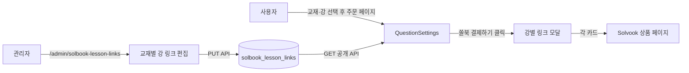

# 쏠북 강별 구매 링크 정리 시스템

## 목표

현재 "쏠북에서 결제하기" 버튼은 **단일 URL** 한 개만 가리킨다. 사용자가 보여준 예시처럼 한 교재에 강(Lesson)별 5~6개의 쏠북 상품 링크가 따로 존재하므로,
**버튼 클릭 시 모달이 열리고 해당 교재의 강별 링크가 일목요연하게 정리되어 보이도록** 한다.

관리자는 새 메뉴에서 교재별로 강 단위 링크를 표 형태로 등록·편집한다.

```
[QuestionSettings]
  쏠북에서 결제하기 ▸  →  [모달]
                          영어I_NE능률오선영_변형문제_강별
                          ─────────────────────────────────
                          Lesson 1 [395문항]  →  쏠북 페이지 ↗
                          Lesson 2 [358문항]  →  쏠북 페이지 ↗
                          Lesson 3 [473문항]  →  쏠북 페이지 ↗
                          Lesson 4 [359문항]  →  쏠북 페이지 ↗
                          Lesson 5 [474문항]  →  쏠북 페이지 ↗
                          ─────────────────────────────────
                          [전체 강 모음 페이지 보기]  (선택)
```

---

## 1. 데이터 모델 — `solbook_lesson_links` 컬렉션

### 새 파일 [lib/solbook-lesson-links-store.ts](lib/solbook-lesson-links-store.ts)

```ts
export const SOLBOOK_LESSON_LINKS_COLLECTION = 'solbook_lesson_links';

export type SolbookLessonLink = {
  lessonKey: string;        // "Lesson 1" 등 (UI 표시 + 매칭 용)
  url: string;              // https://solvook.com/products/...
  label?: string;           // "[395문항]" 등 보조 라벨
  itemCount?: number;       // 395 같은 숫자(있으면 정렬·표시에 사용)
  order?: number;           // 표시 순서(직접 정렬 가능)
};

export type SolbookLessonLinksDoc = {
  _id?: ObjectId;
  textbookKey: string;            // 예: "영어I_NE능률오선영_변형문제"
  groupTitle?: string;            // 예: "영어I_NE능률오선영_변형문제_강별"
  groupUrl?: string;              // 강별 모음 페이지(블로그·랜딩) — 선택
  groupLabel?: string;            // 모음 링크 라벨
  lessons: SolbookLessonLink[];
  updatedAt: Date;
  updatedBy?: string;
};
```

### 스토어 함수
- `getSolbookLinksMap()` — 전체 맵 `Record<textbookKey, doc>` (공개 API용)
- `getSolbookLinksFor(textbookKey)`
- `upsertSolbookLinks(textbookKey, payload)`
- `deleteSolbookLinks(textbookKey)`

### 인덱스 스크립트 [scripts/init-solbook-lesson-links-indexes.ts](scripts/init-solbook-lesson-links-indexes.ts)
- `{ textbookKey: 1 }` (unique)

---

## 2. Public API

### `GET /api/settings/solbook-lesson-links`
새 파일 [app/api/settings/solbook-lesson-links/route.ts](app/api/settings/solbook-lesson-links/route.ts)

- 비인증 허용, `Cache-Control: no-store`
- 응답: `{ map: Record<textbookKey, { groupTitle?, groupUrl?, groupLabel?, lessons: [...] }> }`

`QuestionSettings` 가 `/api/settings/variant-solbook` 옆에서 같이 fetch.

---

## 3. 관리자 API

### `GET /api/admin/solbook-lesson-links` — 전체 목록
### `PUT /api/admin/solbook-lesson-links/[textbookKey]` — upsert
### `DELETE /api/admin/solbook-lesson-links/[textbookKey]`

`requireAdmin` 보호. 디렉터리:
- [app/api/admin/solbook-lesson-links/route.ts](app/api/admin/solbook-lesson-links/route.ts)
- [app/api/admin/solbook-lesson-links/[textbookKey]/route.ts](app/api/admin/solbook-lesson-links/[textbookKey]/route.ts)

---

## 4. 관리자 페이지 — 강별 링크 관리

### 새 페이지 [app/admin/solbook-lesson-links/page.tsx](app/admin/solbook-lesson-links/page.tsx)

레이아웃:
- **좌측 — 교재 리스트** (`/api/settings/variant-solbook` 의 `textbookKeys` 사용)
  - 각 교재 옆에 "강 N개 등록됨" 배지
  - 검색 입력
- **우측 — 선택된 교재 편집 패널**
  - 모음(landing) 정보: `groupTitle`, `groupUrl`, `groupLabel` 입력
  - 강별 표:
    - 행: `lessonKey`(필수), `url`(필수), `label`, `itemCount`, `order`
    - 「행 추가」/「행 삭제」/「위·아래 이동」 버튼
  - 「저장」 / 「되돌리기」 / 「전체 삭제」
- 표 위 `<details>` 안에 사용자가 보여준 형태의 링크 블록 예시(가이드만, 파싱 없음)

### 사이드바 링크 추가 [app/admin/page.tsx](app/admin/page.tsx)
`UPLOADS` 또는 `SETTINGS` 섹션에 다음 한 줄 추가:

```tsx
<Link href="/admin/solbook-lesson-links" className="...">쏠북 강별 링크 관리</Link>
```

배치는 기존 "변형문제 쏠북 교재" 설정 카드 근처가 자연스러우니 `SETTINGS` 섹션이 적합. 카드 안에서 `<a href="/admin/solbook-lesson-links">강별 링크 편집 →</a>` 도 같이 추가.

---

## 5. 주문 화면 변경 — `QuestionSettings.tsx`

### 신규 컴포넌트 [app/components/SolbookLessonLinksModal.tsx](app/components/SolbookLessonLinksModal.tsx)

Props:
```ts
{
  open: boolean;
  onClose: () => void;
  textbookKey: string;
  groupTitle?: string;
  groupUrl?: string;
  groupLabel?: string;
  lessons: SolbookLessonLink[];
  selectedLessonKeys?: string[];   // 사용자가 주문에서 선택한 강 (강조용)
}
```

UX:
- 헤더: 교재 키 / 그룹 타이틀
- 강별 카드 리스트
  - 사용자가 이 강을 선택했다면 카드 좌측에 `★ 선택함` 배지 + 살짝 강조
  - 우측 큰 버튼: `쏠북에서 보기 ↗` (target=_blank)
- 하단: `groupUrl` 있으면 "전체 강 모음 페이지 ↗" 보조 버튼
- ESC / 배경 클릭 / X 버튼 닫기

### `QuestionSettings.tsx` 수정 ([app/components/QuestionSettings.tsx](app/components/QuestionSettings.tsx))

기존 단일 버튼 (라인 1366~1375):

```tsx
{solbookPurchaseUrl.trim() && (
  <a href={solbookPurchaseUrl.trim()} ...>쏠북에서 결제하기 →</a>
)}
```

를 다음으로 교체:

```tsx
{(() => {
  const links = solbookLessonLinksMap[selectedTextbook];
  const hasLessonLinks = !!(links?.lessons?.length);

  if (hasLessonLinks) {
    return (
      <button onClick={() => setSolbookLinksOpen(true)} className="...amber...">
        쏠북에서 결제하기 → ({links.lessons.length}개 강 링크)
      </button>
    );
  }
  // fallback: 기존 단일 URL
  if (solbookPurchaseUrl.trim()) {
    return <a href={solbookPurchaseUrl.trim()} ...>쏠북에서 결제하기 →</a>;
  }
  return null;
})()}

<SolbookLessonLinksModal
  open={solbookLinksOpen}
  onClose={() => setSolbookLinksOpen(false)}
  textbookKey={selectedTextbook}
  {...(solbookLessonLinksMap[selectedTextbook] ?? { lessons: [] })}
  selectedLessonKeys={selectedLessons /* 이미 부모로부터 받음 */}
/>
```

추가 상태:
- `solbookLessonLinksMap` (`/api/settings/solbook-lesson-links`에서 fetch, 마운트 1회)
- `solbookLinksOpen`

`selectedLessons`는 이미 `QuestionSettings`로 전달되는 prop이므로 강조 표시에 그대로 사용.

---

## 6. 흐름



---

## 7. 마이그레이션 / 백워드 호환

- 기존 `settings.variantSolbook.purchaseUrl`(단일 URL)은 **fallback**으로 유지
- 강별 링크가 등록된 교재는 모달, 미등록 교재는 기존 단일 URL 버튼 그대로
- 사용자 예시 데이터(영어I_NE능률오선영, 영어I_YBM박준언) 두 건은 관리자 페이지에서 직접 입력

---

## 8. 구현 순서 (Todo)

1. `lib/solbook-lesson-links-store.ts` — 타입/CRUD
2. `scripts/init-solbook-lesson-links-indexes.ts` — 인덱스
3. `GET /api/settings/solbook-lesson-links` — 공개 맵
4. 관리자 API: `GET/PUT/DELETE /api/admin/solbook-lesson-links[/{key}]`
5. `app/admin/solbook-lesson-links/page.tsx` — 좌(목록)/우(편집) 레이아웃
6. `app/admin/page.tsx` 사이드바 링크 + 「변형문제 쏠북 교재」 카드 안 진입 링크
7. `app/components/SolbookLessonLinksModal.tsx` — 모달 컴포넌트
8. `app/components/QuestionSettings.tsx` — 단일 버튼을 모달 트리거로 교체 (단일 URL fallback 유지)
9. `tsc --noEmit + ReadLints` 검증
